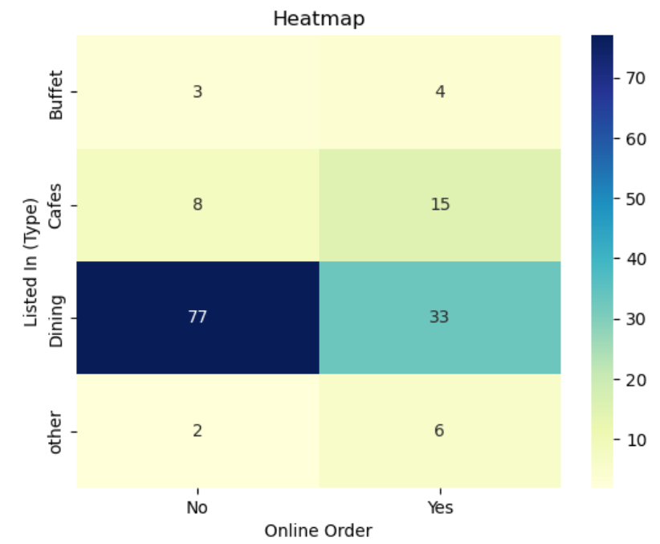

# 🍽️ Zomato Data Analysis using Python

> An Exploratory Data Analysis (EDA) project that uncovers customer preferences, restaurant trends, and ordering behavior using the Zomato restaurant dataset.


---

## 📌 Project Overview

The restaurant industry generates massive amounts of customer and business data every day. Analyzing this information helps restaurants understand customer preferences, improve services, and make data-driven business decisions.

In this project, I performed **Exploratory Data Analysis (EDA)** on the Zomato restaurant dataset using Python. The analysis focuses on identifying trends in restaurant types, customer ratings, pricing, online ordering behavior, and voting patterns through data cleaning, visualization, and statistical exploration.

---

## 🎯 Problem Statement

This analysis aims to answer the following business questions:

* 🍴 Do more restaurants provide online ordering or offline services?
* ⭐ Which types of restaurants are most preferred by customers?
* 💰 What price range is most popular among couples?
* 📈 How do ratings differ between online and offline restaurants?
* 🗳️ Which restaurant has received the highest number of customer votes?
* 🏪 Which restaurant category dominates the market?

---
## 💼 Business Questions Answered

This analysis explores key business questions that can help restaurant owners, food delivery platforms, and market analysts better understand customer behavior and restaurant performance.

| Business Question | Objective |
|-------------------|-----------|
| 🍽️ Which restaurant type is the most popular? | Identify the restaurant category with the highest customer preference. |
| 🗳️ Which restaurant has received the highest number of votes? | Determine the most popular restaurant based on customer engagement. |
| 🚚 Do more restaurants provide online ordering or offline services? | Understand the adoption of online ordering among restaurants. |
| ⭐ How are restaurant ratings distributed? | Analyze overall customer satisfaction levels across restaurants. |
| 💰 What price range do couples prefer for dining out? | Identify the most preferred budget for dining experiences. |
| 📊 Does offering online ordering affect restaurant ratings? | Compare customer ratings between restaurants with and without online ordering. |
| 🍴 Which restaurant types receive the most customer votes? | Evaluate customer engagement across different restaurant categories. |
| 🔥 Which restaurant types are more likely to accept online orders? | Understand how ordering preferences vary across restaurant categories. |

---

## 🎯 Expected Outcomes

By answering these questions, the project aims to:

- Understand customer dining preferences.
- Identify popular restaurant categories.
- Analyze the impact of online ordering on customer satisfaction.
- Discover spending patterns among customers.
- Generate actionable insights through data visualization.
- Demonstrate practical Exploratory Data Analysis (EDA) techniques using Python.

---
## ✨ Project Highlights

- 📊 Performed end-to-end Exploratory Data Analysis (EDA) on restaurant data.
- 🧹 Cleaned and transformed raw data for analysis.
- 📈 Built multiple visualizations using Matplotlib and Seaborn.
- 🔍 Answered real-world business questions using data.
- 💡 Generated actionable insights on customer preferences and restaurant trends.
- 📒 Developed using Jupyter Notebook with Python.
  
---

## 🛠️ Tech Stack

* Python
* Pandas
* NumPy
* Matplotlib
* Seaborn
* Jupyter Notebook

---

## 📂 Project Structure

```text
Zomato-Data-Analysis/
│
├── data/
│   └── Zomato-data.csv
│
├── notebooks/
│   └── Zomato_Data_Analysis_Using_Python.ipynb
│
├── images/
│   ├── restaurant_types.png
│   ├── online_orders.png
│   ├── ratings_distribution.png
│   ├── couple_cost.png
│   ├── online_vs_offline_ratings.png
│   └── heatmap.png
│
├── requirements.txt
├── README.md
└── LICENSE
```

---

## 📊 Dataset Information

The dataset contains restaurant-related information including:

* Restaurant Name
* Restaurant Type
* Customer Votes
* Ratings
* Online Order Availability
* Approximate Cost for Two People

---

## 🔍 Analysis Workflow

### 1️⃣ Data Loading

* Imported dataset using Pandas
* Displayed dataset preview

### 2️⃣ Data Cleaning

* Converted restaurant ratings into numerical format
* Removed unnecessary characters from rating values
* Checked data types
* Verified missing values

### 3️⃣ Exploratory Data Analysis

The following analyses were performed:

* Restaurant category distribution
* Total customer votes by restaurant type
* Restaurant with the highest votes
* Online vs Offline ordering comparison
* Ratings distribution
* Approximate dining cost analysis
* Ratings comparison for online and offline restaurants
* Restaurant type vs online ordering heatmap

---

## 📈 Visualizations

The project includes multiple visualizations such as:

* 📊 Count Plots
* 📈 Line Plot
* 📉 Histogram
* 📦 Box Plot
* 🔥 Heatmap

---

## 💡 Key Insights

### 🍴 Restaurant Categories

* Dining restaurants form the largest category in the dataset.

### ⭐ Customer Preference

* Dining restaurants receive the highest number of customer votes, making them the most preferred category.

### 🛒 Online Ordering

* Most restaurants do **not** provide online ordering facilities.

### 📊 Ratings

* The majority of restaurants have ratings between **3.5 and 4.0**.

### 💰 Cost Preference

* Couples most commonly prefer restaurants with an approximate dining cost of **₹300**.

### 📦 Online vs Offline Ratings

* Restaurants offering online ordering generally receive better customer ratings compared to offline-only restaurants.

### 🔥 Restaurant Type vs Ordering Mode

* Dining restaurants are mostly visited offline.
* Cafes receive comparatively more online orders.

---

## 🚀 Getting Started

### Clone the Repository

```bash
git clone https://github.com/yourusername/Zomato-Data-Analysis.git
```

### Install Dependencies

```bash
pip install -r requirements.txt
```

### Launch Jupyter Notebook

```bash
jupyter notebook
```

Open:

```
notebooks/Zomato_Data_Analysis_Using_Python.ipynb
```

---


## 📸 Sample Outputs

Add screenshots of important visualizations inside the **images/** folder and showcase them here.

Example:




---

## 📚 Skills Demonstrated

* Data Cleaning
* Data Preprocessing
* Exploratory Data Analysis (EDA)
* Data Visualization
* Statistical Analysis
* Business Insight Generation
* Python for Data Analytics


---

## 👩‍💻 Author

**Latika Manoj Ray**

Aspiring Data Analyst | Python | SQL | Power BI | Data Visualization | Machine Learning

---

⭐ If you found this project useful, consider giving the repository a **Star**!
